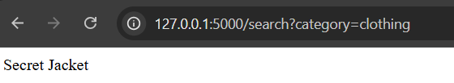
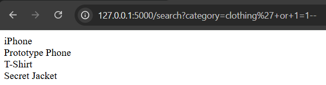

# Basic SQL Injection 

This project display a basic SQL Injection vulnerability in a Flask application using SQLite.

## Vulnerability

The application connects user input directly into the SQL query.

```python
query = f"SELECT name FROM products WHERE category = '{category}' AND released = 0"
```

## Example

Normal request

```
/search?category=clothing
```


Injection request

```
/search?category=clothing' OR 1=1--
```


## Secure Version
```python
query = "SELECT name FROM products WHERE category = ? AND released = 0"
cursor.execute(query, (category,))
```