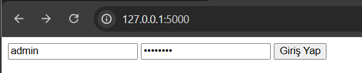
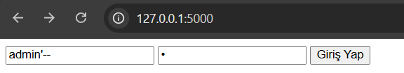

# SQL Injection - Login Bypass

This project display a classic SQL Injection vulnerability in a login form built with Flask and SQLite. The application directly concatenates user input into the SQL query, allowing an attacker to bypass authentication.

## Vulnerability

The application add user-controlled input directly into the SQL query without using parameterized statements.

```python
query = f"""
SELECT * FROM users
WHERE username = '{username}'
AND password = '{password}'
"""
```

## Example

### Normal Login

Username:

```
admin
```

Password:

```
admin123
```



### SQL Injection

Username:

```
admin'--
```

Password:

```
anything
```



The injected query becomes:

```sql
SELECT * FROM users
WHERE username = 'admin'--'
AND password = 'anything'
```

Everything after `--` is treated as a comment, so the password check is ignored.

## Secure Version

```python
query = """
SELECT * FROM users
WHERE username = ?
AND password = ?
"""

cursor.execute(query, (username, password))
```