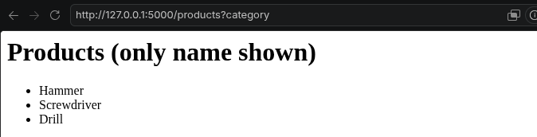
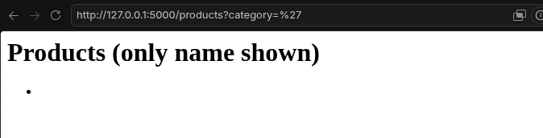
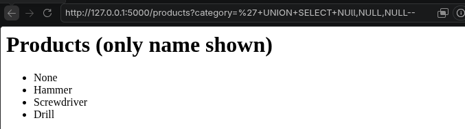
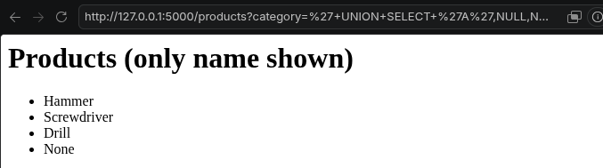
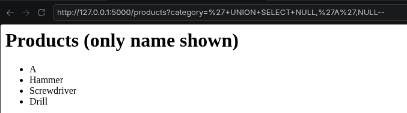
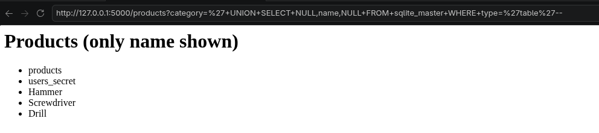
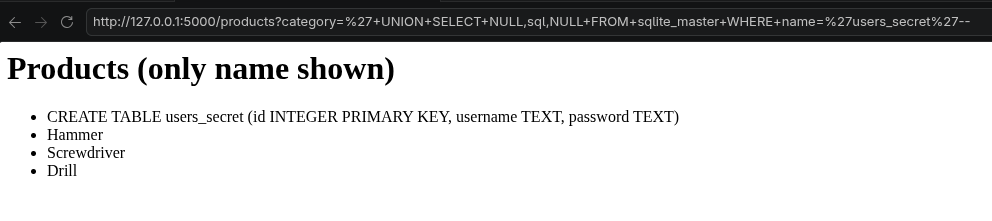
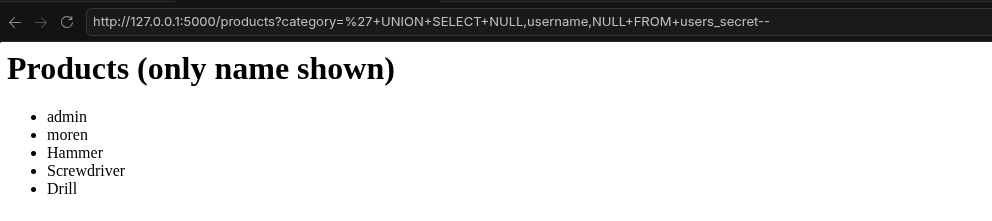

# SQL Injection - Union Attack Example 2

This project demonstrates a SQL Injection UNION attack vulnerability for finding a column that can contain text, using Flask and SQLite. The application takes the category parameter from the URL and directly adds it into the SQL query. Because of this, the query can be modified with a UNION SELECT payload. In this example, the number of columns is found first. Then, different text values are placed into the columns to identify which column is displayed on the page.

# Vulnerability

The application is vulnerable because user input is directly added to the SQL query without using parameterized queries.

```python
query = f"SELECT id, name, price FROM products WHERE name LIKE '%{category}%'"
try:
    rows = cur.execute(query).fetchall()
except Exception as e:
    rows = [(f"SQL error: {e}", "", "")]

conn.close()
```

When the application is opened, the available products are displayed.



A single quote (') is added to test for SQL Injection.




Three NULL values are used to match the number of columns.



Text values are added to find the column that accepts text and is displayed on the page.



The text column is identified by placing text values into each column.



The table names are retrieved from the sqlite_master table.

```
' UNION SELECT NULL,name,NULL FROM sqlite_master WHERE type='table'--
```



The table structure is displayed to find the column names.

```
' UNION SELECT NULL,sql,NULL FROM sqlite_master WHERE name='users_secret'--
```



The usernames are retrieved from the users_secret table using UNION SELECT.

```
' UNION SELECT NULL,username,NULL FROM users_secret--
```



## Secure Version

The secure version uses a parameterized query. User input is treated as data, preventing SQL Injection.

```python
    query = "SELECT id, name, price FROM products WHERE name LIKE ?"
    rows = cur.execute(query, (f"%{category}%",)).fetchall()

    conn.close()
```