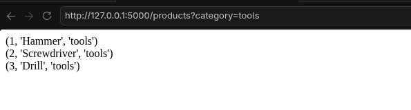
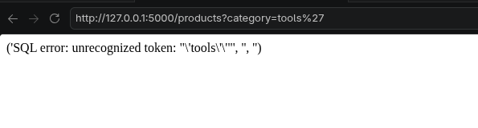
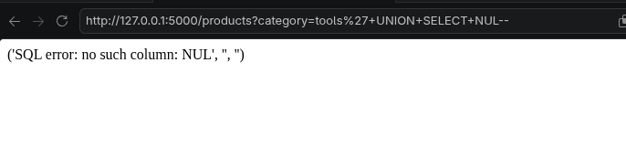
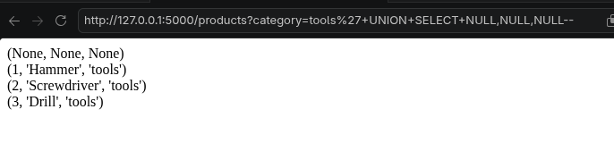

**# SQL Injection - Union Attack**

This project display a SQL injection vulnerability in determining the number of columns returned by the query with Flask and SQLite. UNION SELECT is used to combine two queries. To combine two queries, it is necessary to know the number of columns. In this application, to determine the number of columns, trials are conducted by adding NULL values until the application no longer returns an error.

**## Vulnerability**

The application directly inserts the category parameter into the SQL query, an attacker can inject a UNION SELECT statement. 

```python
query = f"SELECT * FROM products WHERE category = '{category}'"
cursor.execute(query)
```

When the application is opened with a valid category, the products are displayed.



To check if the application is vulnerable to SQL Injection, a single quote (') is added to the end of the URL. An SQL error is returned, showing that the input is included in the SQL query.



UNION SELECT can only work if both queries return the same number of columns. To find the correct number of columns, NULL values are added one by one until no SQL error is returned.

```python
' UNION SELECT NULL--
```

This returns an SQL error because the number of columns is not correct.



Then another NULL values are added:

```
' UNION SELECT NULL, NULL, NULL--
```

This time, the query works successfully. This shows that the original query returns three columns.



The correct column count can now be used in the next UNION SELECT attacks.

**## Secure Version**

The secure version uses a parameterized query. User input is treated as data, not as SQL code.

```python
 query = "SELECT * FROM products WHERE category = ?"
 cursor.execute(query, (category,))
```